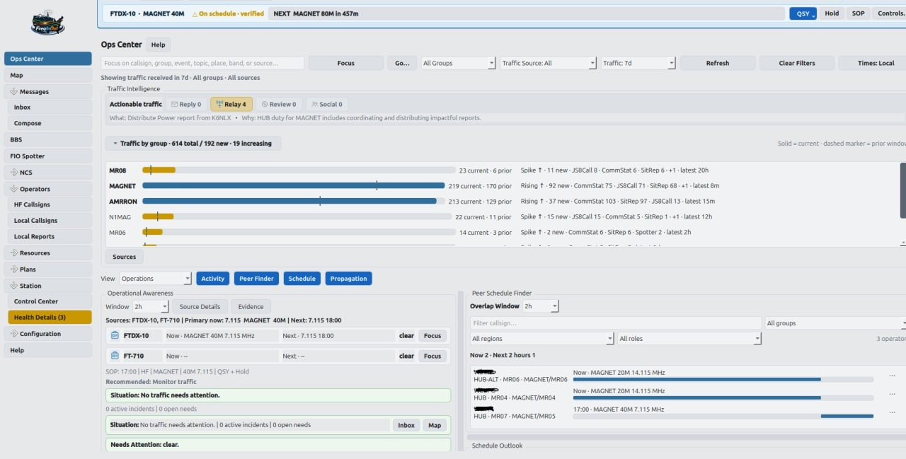
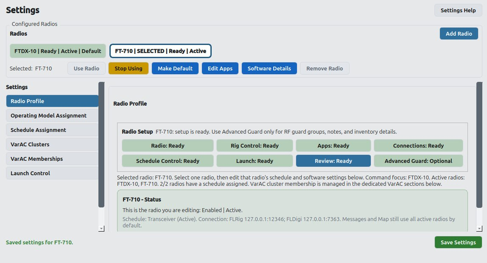
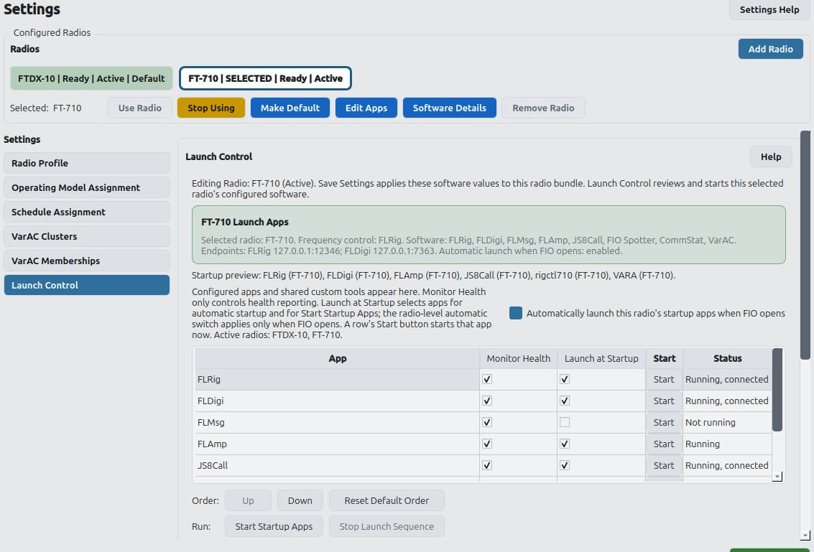
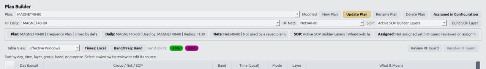
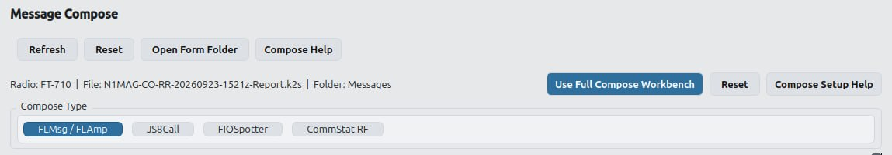
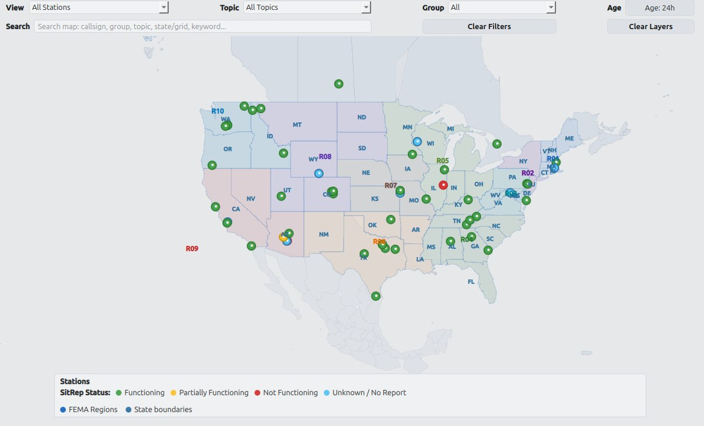

<p align="center">
  
</p>

# FreqInOut 2.0

### A coordinated operations console for HF digital stations

FreqInOut (FIO) brings radio configuration, companion applications,
schedules, message traffic, operational awareness, and station services into
one desktop workspace. Version 2.0 makes the multi-radio architecture the
standard application while keeping a one-radio station simple and fully
supported.

FIO does not replace FLRig, FLDigi, FLMsg, FLAmp, JS8Call, VarAC, VARA,
MeshCore, or Meshtastic. It helps those independently useful applications work
together as a coherent station.

<p align="center">
  
</p>

## One operating picture for the station

- Configure one or more radios with distinct application identities, profiles,
  ports, paths, message locations, and launch behavior.
- Coordinate HF daily schedules, nets, SOP layers, frequency plans, and radio
  assignments using local or UTC time.
- Review supported JS8Call, FIO Spotter, CommStat, FLMsg, FLAmp, VarAC, Mesh,
  and BBS traffic through a common station message library.
- Compose traffic for FLMsg/FLAmp, JS8Call, FIO Spotter, and CommStat RF from
  one workspace.
- Monitor application readiness and safely start only the software assigned to
  the selected radio.
- Use an offline operational map with station, region, status, alert, and
  message-derived context—without an online tile account or API key.
- Manage FIO Spotter watches and Expect responses, Net Control workflows,
  VarAC BBS publication, FLAmp queues, and station-level access policies.
- Connect MeshCore and Meshtastic transports alongside the station's HF
  workflows.

## HF Digital Tri-Mode

HF Digital Tri-Mode combines three complementary families of amateur-radio
software:

- **Fast Light:** FLRig provides radio control, FLDigi supports digital-mode
  operation, and FLMsg and FLAmp support structured messages and file transfer.
- **JS8Call:** provides weak-signal keyboard messaging, store-and-forward
  capabilities, and relay communication using JS8.
- **VarAC and VARA:** provide chat, messaging, file transfer, BBS, and related
  services.

FIO helps bring these independently useful applications together as a
coordinated station. It can discover and configure application instances,
maintain separate identities for multiple radios, manage paths and endpoints,
monitor readiness, control application launching, associate schedules with
radios, and collect supported traffic into a common station message library.

For multi-radio stations, FIO keeps each radio's application profiles, ports,
message locations, and launch identities distinct. Station-level services such
as FIO Spotter, FLAmp Q, CommStat, and the FIO BBS can then work with received
traffic according to the operator's configured access and publication
policies.

## Multi-radio configuration without losing the radio context

Each configured radio has an explicit identity, operating-model assignment,
schedule assignment, application configuration, connections, and launch
policy. Guided Add Radio and Software Administration use the same saved
software identities, so review and runtime behavior stay aligned.



Launch Control distinguishes health monitoring, launch-at-startup policy, and
manual start actions. FIO attributes process and endpoint readiness to the
correct radio instance before deciding that an application is already running.



## Plans, schedules, and operating context

Plan Builder links frequency plans, daily schedules, nets, and SOP layers.
Assignments remain explicit so operators can see which radio and plan own a
scheduled window before it reaches Ops Center or station control.



## Messaging across applications

FIO keeps source identity intact while presenting supported traffic through a
canonical station message library. Compose can stage traffic for multiple
application families without pretending that every transport has the same
capabilities.



## Offline operational map

The map uses bundled geography and station data. It can show known station
locations, regions, status evidence, and operational overlays without relying
on an Internet tile service.



## Supported systems

| Platform | FreqInOut 2.0 support |
|---|---|
| Linux | Source install and guided installer; tested across common desktop distributions |
| Windows 10/11 | Source install; no 2.0 executable installer is currently published |
| macOS | Source install using a current Python; signed/notarized packaging is not currently provided |

Python **3.10 through 3.13** is accepted by FIO; Python 3.11 is the tested and
recommended release interpreter. Companion radio applications are installed
separately and remain under the operator's control.

## Install from the public repository

### Windows PowerShell

Install Git and 64-bit Python 3.11 first:

```powershell
git clone https://github.com/N1MAG/FreqInOut.git "$HOME\FreqInOut"
Set-Location "$HOME\FreqInOut"
py -3.11 install_freqinout.py
.\start-multi-rig.cmd
```

### macOS

Install Git and Python 3.11 from Python.org or Homebrew:

```bash
git clone https://github.com/N1MAG/FreqInOut.git "$HOME/FreqInOut"
cd "$HOME/FreqInOut"
python3.11 install_freqinout.py
./start-multi-rig.sh
```

### Linux

The guided installer installs required system packages where supported,
creates FIO's virtual environment, and prepares the desktop launcher:

```bash
git clone https://github.com/N1MAG/FreqInOut.git "$HOME/FreqInOut"
cd "$HOME/FreqInOut"
bash install_FreqInOut_linux.sh
```

See the [installation guide](docs/Installation.md) for distribution details,
custom paths, repair, update, and uninstall instructions.

## Upgrading an existing FreqInOut station

FreqInOut 2.0 is designed to carry an existing single-radio station forward.
Before upgrading:

1. Close FIO and affected companion applications.
2. Create and verify a restorable backup of the existing FIO profile.
3. Update the application using the documented platform procedure.
4. Review the proposed default-radio conversion before confirming it.
5. Verify software paths, endpoints, schedules, and Launch Control after the
first 2.0 start.

The migration preserves the existing station as the default radio and brings
its schedules, messages, software settings, and operating data forward. Adding
a second radio is optional. The conversion path has automated rehearsal
coverage, but operators should treat the verified backup as mandatory and be
prepared to review or rebuild affected companion-application settings if an
older station differs from the rehearsed profile. See the [FreqInOut 2.0 upgrade guide](docs/FreqInOut%20Version%202%20Upgrade%20Guide%20for%20Current%20Single%20Radio%20Users.docx)
for the Windows, macOS, and Linux workflows and rollback guidance.

## First configuration

The recommended order is:

1. Enter the station identity and location under **Configuration**.
2. Define the operating groups used by scheduling, filtering, access policies,
   and publication rules.
3. Add or review the first radio and select the software it actually uses.
4. Review Software Administration and Launch Control for that radio.
5. Create or assign a frequency plan and schedule.
6. Open Ops Center, Messages, and Map to confirm the resulting station context.

The in-app [FreqInOut Guide](docs/guide.html) provides the full reference for
each workspace, setup flow, application family, and recovery action.

## Data, privacy, and diagnostics

- FIO stores its settings and operational data locally.
- The native map is designed to remain useful offline.
- External network services are used only by features the operator enables.
- Companion-app paths and credentials remain on the local station.
- OS credential storage is used for supported saved passphrases when a keyring
  backend is available; FIO does not fall back to plaintext storage.

When reporting a problem, include the operating system, FIO version, affected
radio/application, reproduction steps, and the relevant application logs.
Review every attachment for callsigns, message contents, access codes, local
paths, and other information you do not want to share. Database files are not
normally needed unless support specifically requests them.

The main FIO logs are located in the configured profile root:

- `freqinout.log`
- `perf_metrics.log`
- generated `fio_cpu_hotspot_*.txt` or UI-hang evidence, when present

## Documentation

- [FreqInOut User Guide](docs/guide.html)
- [Installation and update guide](docs/Installation.md)
- [Linux installer reference](docs/FreqInOut-linux-installer.md)
- [Changelog](CHANGELOG.md)
- [Security and support](SECURITY.md)
- [Credits](CREDITS.md)

## Dedication and continued development

Dedicated to my Dad (SK), a U.S. Navy Radioman who learned HF Digital Tri-Mode
at age 86.

If FIO benefits your station, please consider supporting its continued
development. There's more to come.

[buymeacoffee.com/n1mag](https://buymeacoffee.com/n1mag)

## License

FreqInOut is licensed under the GNU General Public License v3. See
[LICENSE.md](LICENSE.md).
