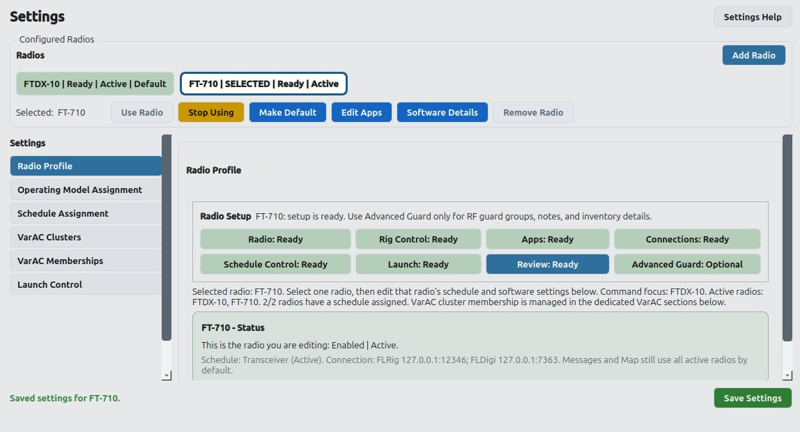
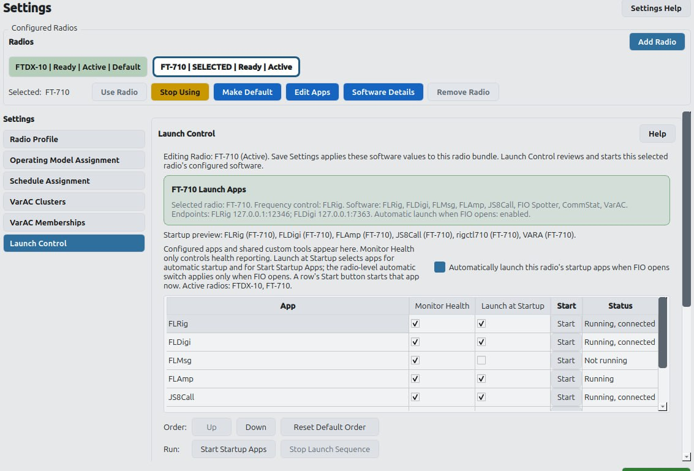

# Configure your first radio

  Configuration → Radios
  Seven reviewed steps
  One saved identity

Guided Add Radio prepares the radio and all selected radio-owned software identities as one reviewed change. Discovery helps propose settings, but nothing is committed until the final save.

## Before you open the assistant

- Power on the radio you intend to configure.
- Connect its normal USB, serial, or network interface.
- Install the companion applications the radio will use.
- Close duplicate application instances that could already own the same port or profile.
- Decide whether the radio should become active immediately or remain configured but paused.

## Open Guided Add Radio

1. Open **Configuration**.
2. Select **Radios**.
3. Select **Add Radio**.

Do not create separate application records first unless you are deliberately recovering an existing unassigned instance. Add Radio and Software Administration use the same saved identities.

## Complete the seven steps

### 1. Radio

Choose the manufacturer and model, then give the radio a readable display name. Select its station role and whether FIO should use it after save.

### 2. FIO Behavior

Choose the operating model and control responsibility. This describes what FIO may do; it does not bypass RF Guard or application readiness.

### 3. Software

Select only the software this radio actually uses. FIO can prepare the JS8Call, Fast Light, and VarAC families, while FIO Spotter and CommStat remain explicit choices.

### 4. Connections

Review the endpoints and paths under the application that owns them. Existing files and profiles are evidence—not permission for FIO to overwrite them. Browse when the proposed resource is not clearly correct.

### 5. Safety

Choose antenna or shared-resource groups and supported bands. These settings help RF Guard coordinate resources; they are not merely descriptive labels.

### 6. Schedule

Choose an existing Frequency Plan, defer the assignment, or request Plan Builder after save. A newly created plan is blank until schedule content is added.

### 7. Review / Save

Review the radio identity, software responsibilities, endpoints, paths, launch recipes, RF Guard choices, schedule assignment, warnings, and follow-up actions. Save only when the summary describes the station you intend to operate.

  <strong>Expected result</strong>
  The radio appears immediately under Configuration → Radios, and each selected software family shows the same named radio and the paths, endpoints, and launch identity reviewed before save.

## Warnings and blockers

- A **warning** means FIO has a reasonable, non-destructive proposal that should be verified.
- A **blocker** means saving could create an ambiguous identity, reuse an exclusive port or path, or risk an existing configuration.
- Discovery and review do not launch applications or rewrite native configuration.
- If preparation fails, retain the selections and use **Retry preparation**.

## Review Software Administration

After save, open **Configuration → Software**:

1. Choose a software family.
2. Choose the configured radio.
3. Choose a task such as API & Radio, Message Storage, Launch, or Health.
4. Confirm that the saved identity matches the final Add Radio review.

## Review Launch Control

Launch Control distinguishes three separate decisions:

- Whether FIO monitors an application.
- Whether FIO starts it automatically.
- Whether the operator starts it manually now.

Leave automatic launch off until paths, endpoints, and application ownership have been reviewed.

## A radio that is not currently available

A configured radio can remain paused. Use **Stop Using** to preserve its setup while removing it from live Scheduler, Messages, Map, and related work. Turn it back on with **Use Radio** when the station is ready.

## Continue

- [Connect a Local Mesh device](/integrations/mesh)
- [Prepare a support request](/support)
