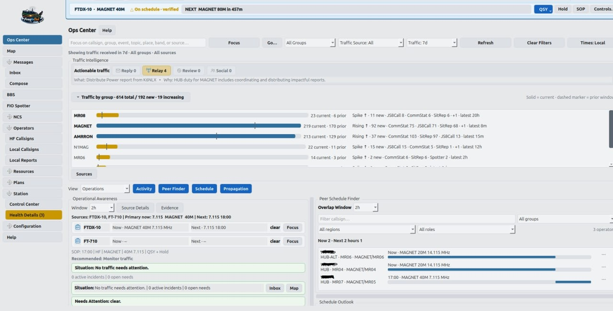

  

    One or more radios
    HF Digital Tri-Mode
    Local-first operations
  

  
Choose your next step

  <h2 class="home-heading">From download to an operational station.</h2>
  
Use the path that matches where you are today. Each guide tells you what to expect, what success looks like, and where to look if something does not verify.

  

    <a class="task-card" href="./install/">
      01→
      <h3>Install or upgrade</h3>
      
Choose the supported package or update an established source installation without losing the station profile.

    </a>
    <a class="task-card" href="./guide/first-radio">
      02→
      <h3>Configure a radio</h3>
      
Walk through the guided radio setup, application discovery, connections, safety, schedule, and final review.

    </a>
    <a class="task-card" href="./integrations/mesh">
      03→
      <h3>Connect Local Mesh</h3>
      
Add MeshCore or Meshtastic, authenticate a device, select how FIO may use its data, and deliberately enable sending.

    </a>
  

  
A coordinated operating picture

  <h2 class="home-heading">The radio context stays visible while you work.</h2>
  
FIO brings together schedules, traffic, operational awareness, and the software assigned to each radio. It coordinates companion applications without replacing them.

  

    
  

  
Built for station reality

  <h2 class="home-heading">Clear when simple. Capable when the station grows.</h2>

  

    

      RADIO
      <h3>One-radio friendly</h3>
      
Version 2 uses the multi-radio architecture while keeping a one-radio station fully supported and straightforward.

    

    

      APPS
      <h3>Distinct application identities</h3>
      
Keep paths, ports, profiles, message storage, and launch behavior aligned with the radio that owns them.

    

    

      FIELD
      <h3>Local-first operation</h3>
      
Station data remains local, and the operational map is designed to remain useful without an online tile service.

    

  

  

    

      <h2>Need a hand?</h2>
      
Start with the support checklist so the version, platform, affected radio, and useful diagnostics are ready without sharing unnecessary private information.

    

    <a href="./support">Open support guide&nbsp; →</a>
  

